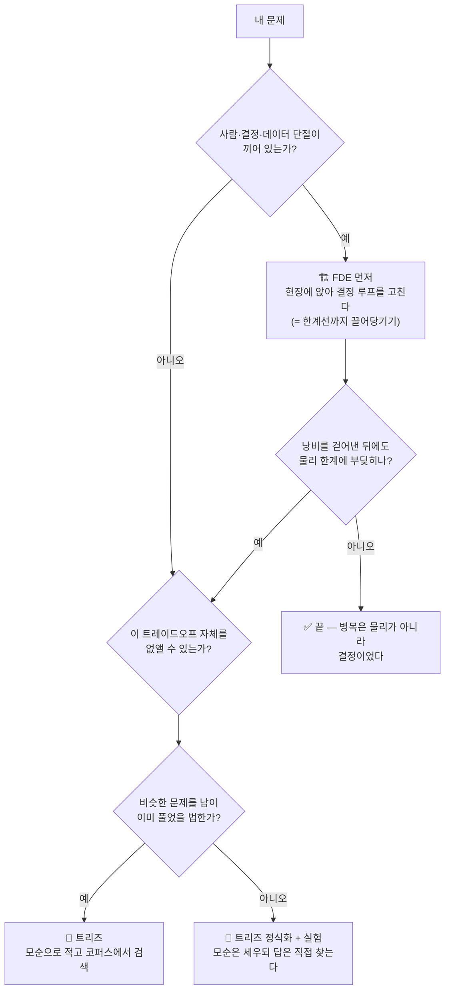

# 11 · 트리즈와 팔란티어, 쉽게 (A Plain Primer)

> **누구를 위한 글인가:** TRIZ를 들어본 적 없는 사람. 또는 "40가지 발명원리" 정도로만 아는 사람.
> **무엇을 얻어 가나:** 두 방법론이 **같은 문제를 만났을 때 각각 무엇을 하는지**, 그리고 **내 문제엔 어느 쪽을 써야 하는지.**
> **깊이 파려면:** 출처·검증·반론이 필요하면 [10 · TRIZ vs FDE 구조 비교](10-triz-vs-fde.md)로. 이 문서는 그 요약이 아니라 **다른 독자를 위한 다른 글**이다.
>
> 🔴 **개정:** 초판의 핵심 그림("곡선 위의 점을 옮긴다")이 적대적 검증에서 **틀린 것으로 판명**돼 §1을 고쳤다 — 팔란티어가 옮긴 건 곡선 *위*의 점이 아니라 **곡선 밖에 있던 점**이었다. 경위는 [10 적대적 검증 기록](10-triz-vs-fde.md) 3라운드 F19·4라운드 F26.

---

## 1. 한 장면 — 같은 문제, 두 개의 답

**문제:** 하수처리장의 블로워(송풍기)가 전기를 너무 많이 먹는다. 폭기(공기 주입)를 줄이면 전기는 아끼지만 암모니아 수치가 올라가 규제를 위반한다. 늘리면 반대다. (실제 사례 → [case-03 Jacobs](../practice/case-03-jacobs-blower-optimization/README.md))

**트리즈 기술자가 왔다면:**
> "이건 **모순**이군요. *공기는 많아야 하고, 동시에 적어야 한다.* 타협하지 맙시다. 같은 산소를 더 적은 전기로 넣는 방법이 어딘가 이미 발명돼 있을 겁니다 — 미세기포? 시간을 쪼개서 간헐 운전? **트레이드오프 자체를 없앱시다.**"

**팔란티어 FDE가 왔다면:**
> "설정값은 **누가** 정하죠? 오퍼레이터가 감으로요? 무슨 데이터를 보고요? …아, 데이터가 SCADA랑 실험실이랑 따로 놀아서 한눈에 못 보시는군요. **그 결정을 개선합시다.** 예측치를 오퍼레이터 워크플로에 꽂아서, 하루 두 번 '지금 이 값으로 바꾸시겠습니까'를 물어보겠습니다."

**팔란티어가 실제로 한 건 후자다.** 모순은 손도 대지 않았다. 대신 **모순 때문이 아니라 결정이 느려서 새던 낭비**를 걷어냈다.

> ⚠️ 위 두 대사는 이해를 돕기 위한 **재구성**이다. 실제 발화 기록이 아니다.

```
  전기 사용량
      ^
      |        X  <- 감으로 운전하던 지점
      |        |     위험을 더 감수한 것도 아닌데 전기를 더 쓰던 상태
      |        |     (= 한계선 "바깥". 순수한 낭비)
      |        |  (1) FDE: 위험 수준은 그대로 두고 전기만 걷어낸다
      |        v
      |  ------o------.
      |               '------.      <- 지금 물리가 허용하는 한계선
      |                       '----    (여기서부터가 진짜 트레이드오프)
      |
      |  (2) TRIZ: 한계선 자체를 아래로 내린다
      |  ...........................
      +-------------------------------> 암모니아 위반 위험
```

화살표가 **수직**인 게 핵심이다. 비스듬히 내려간다면 그건 "전기를 아끼는 대신 위반 위험을 더 지는 것" — 개선이 아니라 그냥 거래다.

> 🎯 **트리즈는 한계선 자체를 내리려 하고, 팔란티어는 한계선 밖에 있던 지점을 선까지 끌어당긴다.**

셋을 구분하면 더 정확하다. 대부분의 현장 개선은 ①이고, ③이 진짜 발명이다.

| | 무엇을 하나 | 누가 |
|---|---|---|
| **① 한계선까지 끌어당기기** | 트레이드오프 때문이 아니라 **결정이 느려서** 생긴 낭비를 걷어낸다 | **FDE** |
| **② 한계선 위에서 이동** | 전기를 더 쓰고 위험을 줄일지 결정한다 — 방법론이 아니라 **경영 판단** | (경영) |
| **③ 한계선 자체를 이동** | 모순을 해소해 트레이드오프를 없앤다 | **트리즈** |

---

## 2. 트리즈, 3분 요약 (딱 세 가지만)

소련 해군 카스피해 소함대 **발명심사부**의 심사관이던 **겐리히 알트슐러(Genrich Altshuller)** 가 1946년부터 만든 발명 방법론. (국가 특허청이 아니라 군의 발명 심사 부서였다 — 하루 종일 남의 발명을 뜯어보는 자리였다는 점이 중요하다.) 러시아어 약자 TRIZ = "발명적 문제해결 이론". 핵심은 셋뿐이다.

### ① 모순 (Contradiction) — 문제를 이렇게 적는다

좋은 문제는 항상 **"A를 좋게 하면 B가 나빠진다"** 형태다. 트리즈는 문제를 반드시 이 꼴로 다시 쓴다.

> **알트슐러의 교과서 예제** (ARIZ 원문): 전파망원경 안테나를 벼락에서 지켜야 한다. *피뢰침을 많이 세우면 안테나는 안전하지만, 피뢰침이 전파를 흡수해 수신이 나빠진다. 적게 세우면 수신은 좋지만 벼락에 무방비다.*

여기서 한 걸음 더 들어가면 **하나의 대상에 정반대 요구**가 걸린 형태가 나온다. 알트슐러의 원문은 이렇게 적는다 — *"그 공기 기둥은 벼락을 없애려면 **전기가 통해야 하고**, 전파 흡수를 막으려면 **통하지 않아야 한다**."*

여기가 핵심이다. **두 요구가 동시에 걸려 있다** — 그래서 타협 말고는 길이 없어 보인다. 트리즈는 여기서 포기하지 않고 *"언제?"* 를 묻는다. 벼락은 드물게, 순식간에 친다. 그러면 **벼락이 치는 순간에만 통하고 나머지 시간엔 안 통하면** 된다. 답: 평소엔 중성인 공기가 벼락이 칠 때 **스스로 이온화**해 그 순간만 피뢰침이 된다.

> 이 흐름이 트리즈의 전부다. **모순을 있는 그대로 적는다 → 타협하지 않는다 → 분리할 축(언제/어디서/누구에게)을 찾는다.** 40원리는 그다음이다.

### ② 이상해결책 (IFR) — 답을 이 방향에서 찾는다

*"시스템을 조금도 복잡하게 만들지 않고, 어떤 것도 나빠지지 않으면서, 문제만 사라진 상태."* 현실적으로 가능한 걸 먼저 생각하면 타협안이 나온다. 그래서 **불가능한 이상점부터 적어놓고 거꾸로** 내려온다.

### ③ 축적된 해법 코퍼스 — 남의 답을 빌려온다

알트슐러의 진짜 발견은 *"발명가들이 같은 수를 계속 반복해서 쓴다"* 였다. 그래서 그걸 목록으로 만들었다 — **40가지 발명원리**, **76가지 표준해**, 그리고 "이 모순엔 보통 이 원리들이 먹힌다"는 **모순행렬(39×39)**.

> ⚠️ **가장 흔한 오해:** "트리즈 = 40원리"가 아니다. 40원리는 **마지막 단계의 검색 도구**다. 트리즈의 진짜 무게는 **문제를 모순으로 정확히 적어내는 앞 단계**에 있다. 40원리만 아는 것은 사전만 들고 외국어를 한다는 뜻이다.

---

## 3. 팔란티어 FDE, 3분 요약

**FDE(Forward Deployed Engineer)** 는 고객 현장에 나가 일하는 엔지니어다. 요구사항 문서를 받는 게 아니라 **가서 본다.** 팔란티어는 사내에서 이들을 **"Delta"** 라 부르고(공식 블로그 축자: *"Internally, we call them 'Devs' and 'Deltas.'"*), 본사 제품 엔지니어인 **"Dev"** 와 이렇게 대비한다:

> *"**Dev의 초점은 '하나의 역량, 여러 고객'**, **Delta의 초점은 '한 고객, 여러 역량'**."* — 팔란티어 공식 블로그(2019)

한 프로젝트에는 보통 **Echo**(Deployment Strategist, 도메인·고객·채택 쪽)와 **Delta**가 섞여 들어간다 — 둘 다 팔란티어 내부 호칭이다.

> ⚠️ **단, 깔끔한 분업으로 오해하지 말 것.** 팔란티어 자신의 서술은 이렇다 — *"**이론상** Echo는 PM에 가깝고 Delta는 더 기술적이지만, **실제로는 둘 다 혼합이고 경계는 아주 자주 심하게 흐려진다**."* 이 글에서 둘을 나눠 쓰는 건 **설명을 위한 단순화**다.

([01](01-fde-model.md) · [02](02-problem-solving-playbook.md))

- **몰입(Immerse)** — 사람들이 *말하는* 프로세스가 아니라 *실제* 프로세스를 본다. 특히 세 곳을 판다: 문서 밖에서 일어나는 결정 / 시스템에 안 남는 데이터 / 수년째 사람이 손으로 메워온 **임시방편**.
- **옳은 문제 정의(Frame)** — 좋은 문제의 조건: 운영상 **결정 하나**와 연결되고, 측정 가능하고, **정치적으로 실행 가능**할 것.
- **온톨로지(Ontology)** — 현실을 **개체(Object type)·관계(Link type)·행동(Action type)** 으로 모델링한다(셋 다 팔란티어 공식 용어). 핵심은 마지막 것: 화면에서 버튼을 누르면 현실이 바뀌어야 한다. ([03](03-ontology.md))
- **자갈길 먼저(Gravel road)** — 예쁜 플랫폼 말고, 이 문제 하나를 진짜로 푸는 최소한의 것부터. 팔란티어 자신의 표현으로는 *"기술적 선택지를 유지하면서 **초기 유스케이스를 프로덕션에 올리는 가장 짧은 경로**"* 다.

> ⚠️ **여기서도 흔한 오해:** 팔란티어의 목표는 대시보드가 아니다. 공식 문서 축자 — 온톨로지는 *"기업의 **결정**을 표상한다, 단순히 데이터가 아니라"*, 그리고 *"실시간으로 결정이 내려질 때 **행동 루프를 닫는 것**이 운영 시스템과 분석 시스템을 가른다."* **행동까지 가지 못하면 실패**로 친다.

---

## 4. 놀라운 것: 둘은 서로를 모르는데 닮았다

트리즈는 1946년 소련 해군에서, FDE는 2000년대 미국 정보기관 현장에서 나왔다(창시 연도는 출처마다 2005년~2010년대 초로 엇갈린다). **공개 자료를 뒤진 범위에서는** 서로 인용한 흔적도, 겹치는 참고문헌도 찾지 못했다([10 §10](10-triz-vs-fde.md) — 내부 자료는 볼 수 없으니 "없다"가 아니라 "못 찾았다"이다). 그런데:

### ① "진짜 문제는 숨어 있다"를 똑같이 말한다

국제TRIZ협회(MATRIZ) 문서는 첫 단계의 목적을 이렇게 적는다 — *"**옳은(right) 문제**를 찾는 것. **증상이 아니라 근본 원인**인, **깊고 숨겨진** 이슈. 처음엔 대개 안 보인다."*
FDE 모델을 분석한 글들은 이걸 *"옳은 문제를 먼저 찾아라"*, 그리고 **숨은 곳 3가지** — *"문서화된 워크플로 밖에서 일어나는 결정 / 기록 시스템에 닿지 않는 데이터 / 수년째 하중을 견뎌온 임시방편"* — 이라고 쓴다.

> ⚠️ **초판은 여기에 "거의 같은 문장이다"라고 썼다가 강도를 내렸다.** 오른쪽 문장은 팔란티어의 공식 문면이 아니라 **Diogo Santos의 분석 에세이** 한 문장이다([10 F33](10-triz-vs-fde.md)). 기관 공식 문서와 테크 에세이가 비슷한 표현을 쓰는 건 그리 놀랍지 않다. **수렴은 여전히 그럴듯하지만 "입증"은 아니다.**

### ② 푼 다음에 일반화해서 창고에 넣는 절차가 둘 다 있다

- 트리즈: ARIZ **8단계** — *"일반 해결 원리를 정식화하라."* **9단계** — *"지식베이스에 없는 원리면 문서화해서 다음 개정에 넣어라."*
- 팔란티어: **자갈길 → 패턴 추출 → 고속도로(재사용 가능한 플랫폼 기능으로 승격)**

같은 구조다. 한 번 푼 것을 다음 사람이 다시 풀지 않게 만든다.

### ③ "한 번 됐다고 일반화하지 마라"까지 같다

- 트리즈: ARIZ 개정 규칙 — 새 아이디어는 *"**최소 20~25개**의 어려운 문제로 검증한 뒤에"* 반영한다.
- 팔란티어: *"고속도로는 패턴이 **반복될 때**"* (규칙은 있으나 **숫자는 없다**)

두 전통 모두 **성급한 일반화를 명시적 규칙으로 금지**한다. 다만 **숫자를 정한 건 트리즈뿐**이다.

> ⚠️ 초판은 여기에 "팔란티어: n≥2"라고 썼다가 정정했다. **n≥2는 팔란티어가 아니라 이 저장소가 자체 현장 운영을 위해 붙인 규칙**이었다([10 F25](10-triz-vs-fde.md)). 자기가 만든 규칙을 남의 전통으로 착각하면 수렴이 아니라 **혼잣말**이 된다.

> 이건 베낀 게 아니라 **수렴진화**다. 서로 모르는 채로 같은 결론에 도달했다면, 그 결론이 **문제해결이라는 일 자체의 성질**에서 나온다는 뜻이다.

---

## 5. 진짜 차이는 하나 — 트레이드오프를 어떻게 대하나

| | 트리즈 | 팔란티어 FDE |
|---|---|---|
| 제약을 만나면 | **깨뜨린다.** ARIZ 원문: *"처음부터 **트레이드오프로 가는 길을 차단**한다"* | **받아들인다.** *"상상된 제약이 아니라 실제 제약 아래에서. 정치·레거시·규제를 **설계 변수로 취급**한다"* |
| 그래서 필요한 것 | 제약을 깰 **남의 지식**(코퍼스) | 제약을 정확히 아는 **몰입**(현장) |
| 잘하는 것 | 물리적으로 얽힌 문제를 **근본에서** 푼다 | 사람과 조직이 얽힌 문제를 **실제로 굴러가게** 만든다 |
| 절차에 없는 것 | *"이걸 애초에 누가 원하나, 누가 막을 것인가"* — 조직 저항을 다루는 별도 이론(ТРТЛ)은 있지만 **문제해결 절차와 통합돼 있지 않다** | *"이 물리적 딜레마 자체를 없앨 수 있나"* |

다른 차이도 있지만 대부분 여기서 파생된다. 제약을 깨려면 빌려올 창고가 있어야 하고, 제약을 받아들이려면 그 제약이 정확히 뭔지 알아야 한다.

---

## 6. 그래서 내 문제엔 어느 쪽인가



> 조직 질문을 **먼저** 묻는 이유: 물리 트레이드오프와 조직 문제가 **둘 다** 있는 경우가 대부분인데, 그때 순서를 거꾸로 하면 아무도 안 쓰는 좋은 해법이 나온다.

**실무 감각으로 요약하면:**

- **"이거 원래 이렇게 할 수밖에 없어요"** 라는 말을 들었다 → **트리즈.** 그 말이 바로 미해소 모순의 신호다.
- **"시스템엔 그렇게 돼 있는데, 실제로는 다들 엑셀로 해요"** 라는 말을 들었다 → **FDE.** 하중 임시방편(load-bearing workaround)을 찾은 것이다.
- 둘 다 들었다 → **FDE 먼저.** 조직 문제를 안 풀면 아무리 좋은 물리적 해법도 배포되지 않는다. 팔란티어가 *"근본 원인은 대개 조직적"* 이라고 말하는 이유다.

---

## 7. 서로에게서 빌려올 것

**팔란티어식으로 일하는 사람이 트리즈에서 가져올 것**
- **문제 진술 양식.** FDE의 문제 진술서엔 정해진 빈칸이 없다. 트리즈의 **미니문제 템플릿**을 그대로 빌려 쓸 수 있다(ARIZ 1.1 원문 구조):
  > ○○를 위한 시스템은 (주요 부품들)로 이루어진다.
  > **모순 1:** A를 이렇게 하면 ─는 좋아지지만 ─가 나빠진다.
  > **모순 2:** A를 반대로 하면 ─는 좋아지지만 ─가 나빠진다.
  > **시스템에 최소한의 변경으로** ○○를 달성해야 한다.

  포인트는 **모순을 양방향으로 두 번 적는 것**이다. 한쪽만 적으면 "그럼 반대로 하면 되잖아"가 남지만, 둘 다 적으면 **빠져나갈 구멍이 없다는 게 눈으로 보인다.** 타협을 차단하는 장치가 바로 이 짝 구조다.
- **타협 금지 습관.** 현장 제약을 받아들이는 건 FDE의 미덕이지만, **깰 수 있었던 제약에 굴복**하는 게 그림자다. 최소 한 번은 "이 트레이드오프 자체를 없앨 수 있나"를 물어보자.

**트리즈로 일하는 사람이 팔란티어에서 가져올 것**
- **숨은 곳 3가지.** 모순을 잘 세우는 것보다 **엉뚱한 문제를 들고 오는 것**이 더 큰 실패다. 문서 밖 결정 / 안 남는 데이터 / 하중 임시방편 — 이 셋을 먼저 훑으면 모순 후보가 달라진다.
- **하중 임시방편 = 모순 탐지기.** 수년째 사람이 손으로 메워온 구멍은 **아무도 해소하지 못한 모순을 조직이 우회한 흔적**이다. 트리즈 관점에서 이보다 좋은 입력값이 없다.
- **행동까지 잇기.** 개념해에서 멈추면 채택되지 않는다. *"이 해법이 실행되려면 누가 무엇을 승인해야 하나"* 를 절차에 넣자.

---

## 8. 한 문단 요약

> 트리즈와 팔란티어 FDE는 서로를 모른 채 같은 결론 여럿에 도달했다 — **진짜 문제는 숨어 있고, 푼 것은 일반화해 창고에 넣어야 하며, 한 번 됐다고 성급히 일반화하면 안 된다.** 갈리는 지점은 하나다. **트리즈는 트레이드오프를 인정하지 않고 깨뜨리려 하고, FDE는 트레이드오프를 현실로 받아들이고 그 안에서 더 나은 지점을 찾는다.** 대부분의 현장 낭비는 **물리 한계 때문이 아니라 결정이 느려서** 생긴다(그건 FDE의 일이다). 그걸 걷어낸 뒤에도 남는 벽이 진짜 물리 한계이고, 거기서부터가 트리즈다. 그래서 순서는 대개 **FDE로 먼저 뚫고, 남은 한계를 트리즈로 친다.**

---

## 더 읽기

- **검증·출처·반론이 필요하면** → [10 · TRIZ vs FDE 구조 비교](10-triz-vs-fde.md) (10회 적대적 검증 기록 포함)
- **팔란티어 방법론 본체** → [02 플레이북](02-problem-solving-playbook.md) · [04 8원칙](04-problem-solving-principles.md) · [03 온톨로지](03-ontology.md)
- **문제 발굴의 계보 전체** → [05 문제 발굴 정전](05-problem-discovery-canon.md)
- **용어 확인** → [99 용어집](99-glossary.md)

## 출처 (Sources)

이 문서는 쉬운 설명을 위해 인용을 최소화했다. **모든 인용문과 사실의 원출처·검증 등급·한계는 [10-triz-vs-fde.md](10-triz-vs-fde.md)의 「부록 A 검증표」와 「출처」에 있다.** 주요 근거만 적으면:

- **ARIZ-85C 영문 원문** (알트슐러 원저 번역, 1차) — 안테나/피뢰침 예제, 미니문제, *"트레이드오프로 가는 길을 차단"*, Part 8·9, 20~25문제 검증 규칙: https://matriz.org/wp-content/uploads/2025/09/Altshuller_ARIZ-85-C_en.pdf
- **MATRIZ(국제TRIZ협회) 문제 식별 도구** — *"옳은 문제 = 증상 아닌 근본 원인 = 숨겨진 이슈"*: https://wiki.matriz.org/docs/triz/problem-solving-tools-5807/
- **알트슐러 재단(공식)**: https://www.altshuller.ru/world/eng/index.asp
- **팔란티어 측** — 이 저장소 [02](02-problem-solving-playbook.md)·[03](03-ontology.md)·[04](04-problem-solving-principles.md)의 출처를 따른다(대부분 2차).
- **블로워 사례** — [case-03](../practice/case-03-jacobs-blower-optimization/README.md). 원문은 팔란티어 impact study이며 **수치는 notional**로 명시돼 있다. 본문의 "폭기 vs 전기" 모순 정식화는 이 저장소의 해석이다.

> ⚠️ 이 문서의 "트리즈라면 이렇게 했을 것" 서술은 **예시를 위한 구성**이며, 실제 트리즈 전문가가 그 사례를 그렇게 풀었다는 기록이 아니다.
